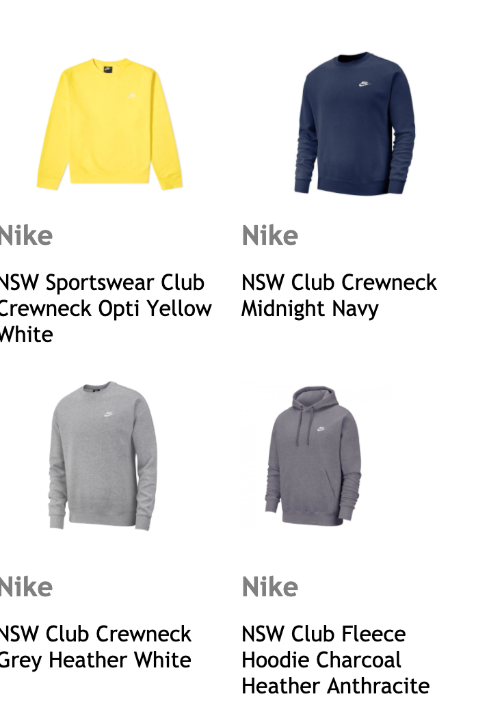
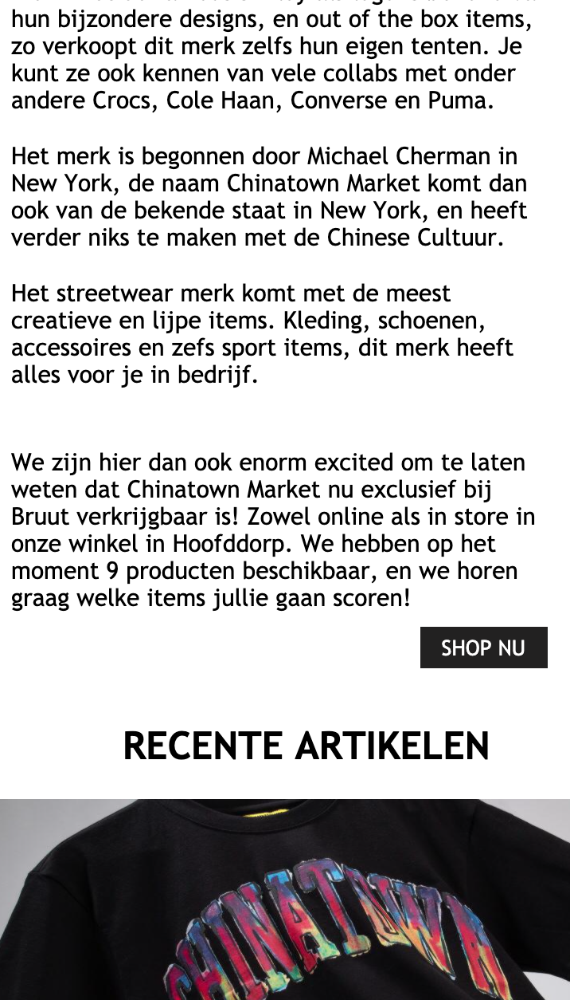

# Procesverslag
**Auteur:** -Mila Dors-

Markdown cheat cheet: [Hulp bij het schrijven van Markdown](https://github.com/adam-p/markdown-here/wiki/Markdown-Cheatsheet). Nb. de standaardstructuur en de spartaanse opmaak zijn helemaal prima. Het gaat om de inhoud van je procesverslag. Besteedt de tijd voor pracht en praal aan je website.

## Bronnenlijst
1. https://css-tricks.com/almanac/
2. https://www.bruut.nl/nl/
3. https://www.w3schools.com/
4. https://cssgradient.io/
5. https://dlo.mijnhva.nl/content/enforced/192602-FDMCI-2000FED116-DMCI-CMD-2021/FED%2020-21%20-%20Blok%201%20-%20Oefening%20JS%203-stap.pdf
6. https://medium.com/javascript-scene/javascript-es6-var-let-or-const-ba58b8dcde75

## Eindgesprek (week 7/8)

De laatste week voor het eindgesprek moest ik nog een kleine inhaasprint maken met de vormgeving. Ik denk dat dit goed is gelukt. Alles staat op de juiste plek en ik heb wat extra elementen toegevoegd. Verder heb ik geprobeerd om javascript toe te voegen, dit ging helaas wat minder. Ik zie niet zo goed wat er fout is gegaan en wanneer ik bij de opdrachten kijk, word ik niet veel wijzer.

**Screenshot(s):**

## Voortgang 3 (week 6)

Deze week ging het best aardig allemaal. Hoewel ik niet zoveel tijd aan het programmeren heb besteed als ik had gewild, is het mij wel gelukt op alle content in de twee pagina's te zetten. Voor het eindgesprek moet ik mij nu dus vooral nog gaan focussen op sommige vormgeving onderdelen zoals: hamburger menu, alles hetzelfde font etc. Verder moet ik kijken naar de interactieve onderdelen. Met javascript gaat dat nog wel even puzzelen worden.

<imh src="images/screenW6.5.png">

## Voortgang 2 (week 5)

-same as voortgang 1-
Na de eerste weken is het steeds beter gegaan. Ik gebruik het internet en de opdrachten voor informatie als ik er even niet meer uitkom. Ik loop nog wel wat achter omdat ik opnieuw begonnen ben, maar omdat ik nu beter begrijp wat ik aan het doen ben komt dat vast goed. Ik heb soms wel nog moeite met dingen goed stijlen, zoals kleine foto's naast elkaar en de juiste tekst etc. 

## Voortgang 1 (week 3)

### Stand van zaken

-dit ging goed & dit was lastig-

Ik vond het best lastig om te beginnen. Ik heb mijn leerboek van vorig jaar en het internet weer even moeten raadplegen. Verder willen niet alle afbeeldingen meewerken, en heb ik wat moeite om alle elementen zo mooi als het orgineel te krijgen. Toen ik eenmaal aan de slag ging en weer een beetje door had wat ik aan het doen was ging het coderen wel wat makkelijker.

**Screenshot(s):**

### Agenda voor meeting

-samen met je groepje opstellen-

### Verslag van meeting

Tijdens het eerste voortgangsgesprek was ik nog niet erg ver, maar had ik wel al genoeg vragen. Zo kreeg ik bijvoorbeeld de afbeeldingen en buttons niet op de juiste plek. De studentasistenten gaven mij de tip om eens te kijken naar background images. Verder heb ik goed kunnen meeluisteren naar de feedback van mijn medestudenten.

## Intake (week 1)

**Je startniveau:** Blauw

**Je focus:** surface 

**Je opdracht:** - https://www.bruteburgers.com/ -

**Screenshot(s):**

 (images/Bruut2.png)

**Breakdown-schets(en):**

